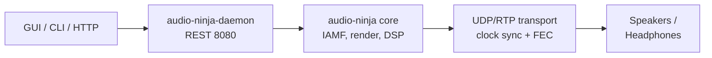

# Audio Ninja 🥷


[](LICENSE)
[](https://www.rust-lang.org/)
[](https://github.com/mr-u0b0dy/audio-ninja/actions)
[](https://codecov.io/gh/mr-u0b0dy/audio-ninja)

Audio Ninja is an IAMF-first wireless immersive audio platform with a daemon-first engine, thin clients, and a full calibration + DSP pipeline.

## Highlights
- Daemon exposes a REST API on port 8080; GUI (Tauri) and CLI are thin clients
- 3D spatial rendering: IAMF, VBAP, HOA, and HRTF binaural downmix
- UDP/RTP transport with PTP/NTP clock sync, jitter buffer, and XOR FEC
- Calibration and DSP: sweeps, IR analysis, delays, trims, EQ, loudness, and DRC
- Built-in discovery (mDNS), BLE control plane, and flexible speaker layouts (2.0 to 9.1.6+)
- CI-backed workspace with fuzzing, benches, and 250+ tests

## Architecture


## Quick Start
- Prerequisites: Rust 1.70+, Linux GUI deps (`webkit2gtk-4.0`, `gtk3`, `openssl`)

```bash
git clone https://github.com/mr-u0b0dy/audio-ninja.git
cd audio-ninja
./scripts/dev-setup.sh    # installs deps, builds workspace
cargo run -p audio-ninja-daemon --release
cargo run -p audio-ninja-cli --release -- status
```

## Workspace Commands
- make dev - fmt + clippy + tests
- make run-daemon - launch daemon
- make run-gui - launch Tauri GUI

## Documentation

### Quick Links
- 📖 **[Full Documentation Site](docs-site/)** - Complete VuePress site with guides and API reference
- 🚀 **[Quick Start Guide](docs-site/src/guide/quick-start.md)** - Get up and running in 5 minutes
- 🎯 **[Installation Guide](docs-site/src/guide/installation.md)** - Platform-specific setup
- 🔌 **[REST API Reference](docs-site/src/api/reference.md)** - Complete API documentation
- 🎨 **[GUI Design System](docs-site/src/design/design-system.md)** - Design guidelines and CSS components

### Component Documentation
- **Daemon**: [crates/daemon/README.md](crates/daemon/README.md) - REST API service
- **CLI**: [crates/cli/README.md](crates/cli/README.md) - Command-line interface
- **Core**: [crates/core/](crates/core/) - Audio processing library

## Status
- Completed: IAMF pipeline, VBAP/HOA/HRTF, calibration + DSP, UDP/RTP transport, CLI/GUI clients
- In progress: libiamf/AOM integration, FFmpeg bindings, expanded GUI features

## Future Plans

### Phase 2: GUI Refactoring & Branding (5 weeks, 40-50 hours)
✅ **Architecture Complete & Production-Ready** — All backend dependencies ready for frontend work

- **Logo & Theme**: Integrate professional logo (assets/logo.png) with Magma Orange color scheme
- **I/O Controls**: Device selection panels, audio source routing
- **Transport Panel**: File loading, play/pause/stop, mode selection (file/stream/mixed)
- **Layout Visualization**: 3D speaker layout with preset configurations (2.0 → 9.1.6)
- **Calibration UI**: Sweep controls, IR visualization, filter design preview
- **Stats Dashboard**: Real-time metrics (latency, packet loss, sync error, CPU/memory)

See [docs-site/src/design/phase2-tasks.md](docs-site/src/design/phase2-tasks.md) for 43 implementation tasks.

### Phase 3: Backend Audio I/O Implementation (3-4 months, 95-135 hours)
Production-ready trait-based abstraction ready for real audio backends

- **ALSA Bindings** (Linux): PCM device I/O, device enumeration, format negotiation (20-30 hours)
- **PulseAudio Bindings**: System audio routing, app-specific routing, fallback handling (15-20 hours)
- **CoreAudio Bindings** (macOS): HAL device abstraction, device detection (20-30 hours)
- **FFmpeg Codec Support**: Opus, AAC, FLAC, AC-3, E-AC-3, TrueHD decoding (25-35 hours)
- **Testing & Optimization**: Unit/integration tests, latency profiling, cross-platform validation (15-20 hours)

See [.github/copilot-instructions.md](.github/copilot-instructions.md#phase-3-backend-audio-io-implementation-production-ready) for detailed implementation plan.

## License

Apache License 2.0. See LICENSE for details.
