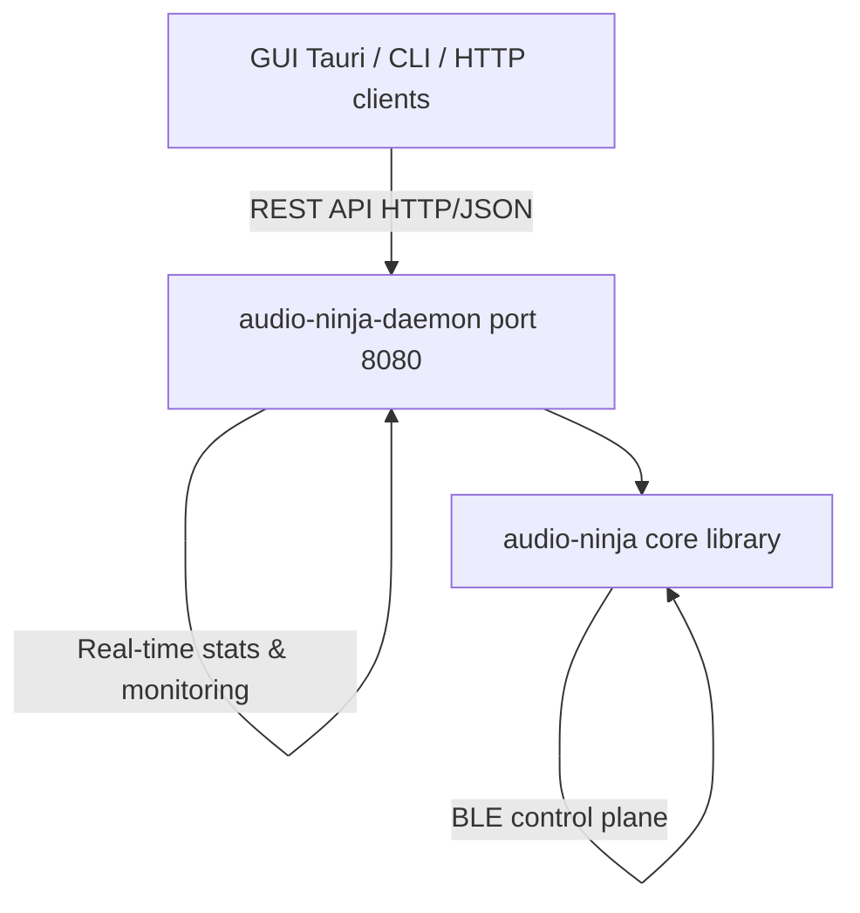

# Audio Ninja 🥷

[](LICENSE)
[](https://www.rust-lang.org/)
[](https://codecov.io/gh/mr-u0b0dy/audio-ninja)
[](https://github.com/mr-u0b0dy/audio-ninja/actions)

**Audio Ninja** is an open-source wireless immersive audio platform with IAMF-first architecture, flexible speaker layouts, networked transport with sync, DSP processing, and room calibration.

## 🏗️ Architecture

Audio Ninja uses a Cargo workspace with a client-server architecture:

**Workspace Structure:**
```
audio-ninja/
├── Cargo.toml              # Workspace root
├── crates/
│   ├── core/               # Core library (IAMF, VBAP, HOA, transport, DSP)
│   │   ├── src/
│   │   ├── examples/
│   │   └── tests/
│   ├── daemon/             # Background engine service (REST API)
│   │   └── src/
│   ├── gui/                # Desktop GUI client (Tauri)
│   │   ├── src/
│   │   └── public/
│   └── cli/                # Command-line interface
│       └── src/
├── docs/                   # Documentation
└── .github/                # CI/CD workflows
```

**Components:**
- **`audio-ninja`**: Core library with IAMF parsing, spatial rendering, transport, calibration
- **`audio-ninja-daemon`**: Background service running the audio engine with REST API (port 8080)
- **`audio-ninja-gui`**: Desktop GUI client for control and monitoring (Tauri + vanilla JS)
- **`audio-ninja-cli`**: Command-line interface for daemon control (`audio-ninja` binary)



## 🚀 Quick Start

### Prerequisites
- Rust 1.70 or later
- Linux: `webkit2gtk-4.0`, `gtk3`, `openssl` (for GUI)

### Setup Options

#### Option 1: DevContainer (Recommended for VS Code)
Provides a containerized development environment with all dependencies pre-configured.

```bash
git clone https://github.com/mr-u0b0dy/audio-ninja.git
cd audio-ninja
code .  # Open in VS Code
# Press Ctrl+Shift+P → "Dev Containers: Reopen in Container"
```

See [.devcontainer/README.md](.devcontainer/README.md) for details.

#### Option 2: Automated Setup
```bash
git clone https://github.com/mr-u0b0dy/audio-ninja.git
cd audio-ninja

# Automated setup (installs dependencies and builds)
./scripts/dev-setup.sh

# Or manual build
cargo build --workspace --release
```

### Development Workflow

Use the Makefile for common tasks:

```bash
make help         # Show all available commands
make dev          # Quick check: format + lint + test
make build        # Build workspace
make test         # Run all tests
make run-daemon   # Start the daemon
make run-gui      # Launch the GUI
make release      # Build optimized binaries
```

### Run Daemon

```bash
cargo run -p audio-ninja-daemon --release
# Or use the systemd service (see daemon README)
```

### Use CLI

```bash
cargo run -p audio-ninja-cli --release -- status
cargo run -p audio-ninja-cli --release -- speaker list
cargo run -p audio-ninja-cli --release -- transport play
```

### Fuzz Testing

Audio Ninja includes fuzzing targets for critical parsers (RTP, clock sync, FEC):

```bash
# Install cargo-fuzz (requires nightly Rust)
cargo install cargo-fuzz

# Run specific fuzz target (e.g., RTP header)
cargo +nightly fuzz run fuzz_rtp_header

# Run all fuzz targets with timeout
cargo +nightly fuzz run --all

# See crates/core/fuzz/README.md for detailed fuzzing guide
```

### Code Coverage

Generate and view code coverage reports:

```bash
# Generate HTML coverage report
make coverage

# Open coverage report in browser
make coverage-open

# Generate LCOV format (for CI/CD)
make coverage-lcov
```

Coverage reports are automatically generated in CI and uploaded to [Codecov](https://codecov.io/gh/mr-u0b0dy/audio-ninja).

See [crates/cli/README.md](crates/cli/README.md) for full CLI documentation.

### Launch GUI

```bash
cargo run -p audio-ninja-gui --release
```

### New: Spatial Audio for Headphones
- **Binaural Rendering**: HRTF-based spatial audio virtualization (Flat, ClosedBack, OpenBack, IEM profiles)
- **Spatial Positioning**: Azimuth, elevation, and distance controls for virtual speaker placement
- Multi-channel to stereo conversion automatically integrated with loudness/DRC pipeline
- See the guide: [docs/binaural_rendering.md](docs/binaural_rendering.md)

### New: Loudness & DRC
- ITU-R BS.1770 loudness measurement (LUFS) and normalization
- Dynamic Range Control (DRC) with Speech/Music/Cinema presets
- Headroom protection via soft limiting (configurable dB, 3ms lookahead)
- See the guide: [docs/loudness_drc.md](docs/loudness_drc.md)

## ✨ Features

### 🎵 Spatial Audio Rendering
- **IAMF (Immersive Audio Model and Formats)**: Parse, decode, and render object-based, channel-based, and scene-based audio
- **3D VBAP**: Vector-Based Amplitude Panning for arbitrary speaker layouts with elevation support
- **HOA Decoder**: Higher-Order Ambisonics (1st/2nd/3rd order) with Basic, Max-rE, and In-Phase modes
- **Binaural Rendering**: HRTF-based virtualization for immersive headphone playback
- **Flexible Layouts**: Support from 2.0 stereo through 9.1.6+ immersive configurations

### 🌐 Networked Audio
- **UDP/RTP Transport**: Real-time audio streaming with timestamp-based synchronization
- **Clock Sync**: PTP, NTP, and system clock support for multi-speaker alignment
- **mDNS Discovery**: Automatic speaker detection and registration
- **Forward Error Correction**: XOR-based FEC with packet loss concealment (silence/repeat/interpolate)
- **Jitter Buffer**: Adaptive buffering with latency compensation

### 🎛️ Control & Configuration
- **BLE GATT Profiles**: Wireless speaker control, pairing, and configuration
- **Speaker Identity**: Role assignment (FL, FR, C, LFE, SL, SR, height channels, etc.)
- **Layout Management**: Dynamic speaker positioning (azimuth, elevation, distance)
- **Calibration Settings**: Per-speaker volume trim, delay compensation, EQ enable/disable

### 🔧 Room Calibration
- **Sweep Generation**: Log sweep and MLS (Maximum Length Sequence) for impulse response capture
- **IR Analysis**: Automatic delay detection, magnitude response extraction
- **Filter Design**: FIR (linear-phase) and IIR (biquad cascade) filters
- **PEQ, Shelving, and Crossover Filters**: Parametric EQ, low/high shelf, high/low pass
- **DSP Export**: Generate CamillaDSP and BruteFIR configuration files

### 🎚️ Audio Processing
- **Multi-Format Support**: Opus, AAC, FLAC, PCM (with FFmpeg bindings planned)
- **Downmix/Upmix**: Automatic channel count adaptation
- **Pipeline Architecture**: Demux → Decode → Render workflow
- **Per-Speaker DSP**: Individual processing chains with filter management


## 📖 Documentation

### Guides

- **[Cross-Platform Build Guide](docs/CROSS_PLATFORM.md)**: Linux, macOS, and Windows setup and build instructions
- **[Release Process](docs/RELEASE.md)**: Versioning and automated release workflow
- **[Icon Design Guide](docs/ICON_DESIGN.md)**: Design and generate application icons for all platforms
- **[Codec Integration Guide](docs/CODEC_INTEGRATION.md)**: Integrate audio codecs (Opus, FLAC, AAC) and FFmpeg
- **[Firmware Update Mechanism](docs/FIRMWARE_UPDATE.md)**: Over-the-air firmware updates with rollback support
- **[DevContainer Setup](.devcontainer/README.md)**: Containerized development environment

### Modules

- **[Binaural Rendering](docs/binaural_rendering.md)**: HRTF spatial audio for headphones
- **[Loudness & DRC](docs/loudness_drc.md)**: ITU-R BS.1770 loudness and dynamic range control
- **[HRTF](docs/hrtf.md)**: Head-Related Transfer Function binaural rendering
- **[VBAP](docs/vbap.md)**: 3D Vector-Based Amplitude Panning
- **[HOA](docs/hoa.md)**: Higher-Order Ambisonics Decoder
- **Calibration**: Room measurement and correction
- **Network**: UDP/RTP streaming and speaker discovery
- **BLE**: Bluetooth Low Energy control plane
- **FEC**: Forward Error Correction
- **Transport**: RTP, jitter buffer, clock sync

### Examples

#### HRTF Binaural Rendering

```rust
use audio_ninja::hrtf::{HrtfDatabase, HrtfDataset, BinauralRenderer, HeadphoneProfile, HrtfPosition};

let mut db = HrtfDatabase::new(HrtfDataset::Kemar, 48000);
db.load_default_kemar()?;

let renderer = BinauralRenderer::new(db, HeadphoneProfile::Flat);

// Render mono audio from a 45° angle
let mono_input = vec![0.5; 512];
let position = HrtfPosition::new(45.0, 15.0, 1.5);
let (left, right) = renderer.render(&mono_input, &position)?;

// Now you have binaural stereo audio for headphone playback
```

#### Binaural Rendering for Headphones

Run the binaural example:

```bash
cargo run --example binaural_rendering
```

This demonstrates:
- Converting multi-channel surround to stereo binaural
- Selecting headphone profiles (Flat, ClosedBack, OpenBack, IEM)
- Spatial positioning (azimuth, elevation, distance)
- Integration with loudness/DRC pipeline

#### Loudness Normalization + DRC + Headroom

Run the end-to-end example:

```bash
cargo run --example loudness_processing
```

This demonstrates:
- Measuring loudness (integrated/short-term/LRA)
- Normalizing to streaming target (-14 LUFS)
- Applying DRC (e.g., 4:1 ratio, -18 dB threshold)
- Soft-limiting peaks to maintain headroom

For details, read: [docs/loudness_drc.md](docs/loudness_drc.md)

#### VBAP Rendering

```rust
use audio_ninja::vbap::{Vbap3D, create_7_1_4_layout, Vec3};

let speakers = create_7_1_4_layout();
let vbap = Vbap3D::new(speakers);

// Position a sound 30° left, 15° elevated
let source = Vec3::from_spherical(30.0, 15.0, 1.0);
let gains = vbap.render(&source);

// Apply gains to audio channels
for (channel, gain) in audio_channels.iter_mut().zip(gains.iter()) {
    for sample in channel.iter_mut() {
        *sample *= gain;
    }
}
```

#### HOA Decoding

```rust
use audio_ninja::hoa::{HoaDecoder, AmbisonicOrder, DecodingMode, create_5_1_hoa_layout};

let speakers = create_5_1_hoa_layout();
let decoder = HoaDecoder::new(
    AmbisonicOrder::SECOND,
    DecodingMode::MaxRE,
    speakers
);

// Decode 2nd order ambisonics (9 channels) to speakers
let ambisonic_input = vec![1.0, 0.2, 0.3, 0.1, 0.15, 0.05, 0.1, 0.08, 0.12];
let speaker_gains = decoder.decode(&ambisonic_input);
```

#### Room Calibration

```rust
use audio_ninja::calibration::*;

// Generate measurement sweep
let sweep = generate_log_sweep(48000, 2.0, 20.0, 20000.0);

// After recording the response, extract impulse response
let ir = extract_ir_from_sweep(&recorded, &sweep, 48000);

// Analyze and design correction filters
let delay_ms = compute_delay(&ir, 48000);
let peq = design_peq(48000, 1000.0, -3.0, 2.0);
```

#### Network Streaming

```rust
use audio_ninja::network::*;
use audio_ninja::fec::XorFec;

// Create sender with FEC
let mut sender = UdpRtpSender::new("0.0.0.0:0", "192.168.1.100:5004", 12345)?;
sender.enable_fec(8); // Group size of 8

// Send audio block
sender.send_block(&audio_block)?;

// Receiver with loss statistics
let receiver = UdpRtpReceiver::new("0.0.0.0:5004")?;
let audio_block = receiver.recv_block()?;
let stats = receiver.statistics();
```

## 🏗️ Architecture

```
┌─────────────────────────────────────────────────────────────┐
│                     Audio Ninja Platform                     │
├─────────────────────────────────────────────────────────────┤
│  Input Layer                                                 │
│  ┌──────────┐  ┌──────────┐  ┌──────────┐                  │
│  │  IAMF    │  │  Opus    │  │  AAC     │  ...              │
│  │  Parser  │  │  Decoder │  │  Decoder │                   │
│  └────┬─────┘  └────┬─────┘  └────┬─────┘                  │
│       └─────────────┴─────────────┘                          │
│                      │                                        │
│  ┌──────────────────▼───────────────────────┐               │
│  │         Render Pipeline                   │               │
│  │  ┌──────────┐  ┌──────────┐  ┌─────────┐│               │
│  │  │  VBAP    │  │   HOA    │  │ Channel ││               │
│  │  │ Object   │  │  Scene   │  │  Bed    ││               │
│  │  │ Renderer │  │ Decoder  │  │  Mix    ││               │
│  │  └────┬─────┘  └────┬─────┘  └────┬────┘│               │
│  │       └─────────────┴─────────────┘     │               │
│  │                Mixer                      │               │
│  └──────────────────┬────────────────────────┘               │
│                     │                                        │
│  ┌──────────────────▼────────────────────────┐              │
│  │         DSP Processing                     │              │
│  │  ┌─────────┐  ┌──────────┐  ┌──────────┐ │              │
│  │  │ Delay   │  │  Volume  │  │   EQ     │ │              │
│  │  │  Comp   │  │   Trim   │  │ Filters  │ │              │
│  │  └─────────┘  └──────────┘  └──────────┘ │              │
│  └──────────────────┬────────────────────────┘              │
│                     │                                        │
│  ┌──────────────────▼────────────────────────┐              │
│  │         Network Transport                  │              │
│  │  ┌─────────┐  ┌──────────┐  ┌──────────┐ │              │
│  │  │   FEC   │  │   RTP    │  │  Jitter  │ │              │
│  │  │ Encoder │  │ Packetize│  │  Buffer  │ │              │
│  │  └─────────┘  └──────────┘  └──────────┘ │              │
│  └──────────────────┬────────────────────────┘              │
│                     │                                        │
│                UDP/IP Network                                │
│                     │                                        │
│  ┌──────────────────▼────────────────────────┐              │
│  │         Speaker Nodes (1..N)               │              │
│  │  ┌─────────┐  ┌──────────┐  ┌──────────┐ │              │
│  │  │   FEC   │  │  Clock   │  │   DAC    │ │              │
│  │  │ Decoder │  │   Sync   │  │  Output  │ │              │
│  │  └─────────┘  └──────────┘  └──────────┘ │              │
│  │          (BLE Control Plane)              │              │
│  └───────────────────────────────────────────┘              │
└─────────────────────────────────────────────────────────────┘
```

## 🛠️ Current Status

### ✅ Completed
- Core IAMF parsing and rendering
- 3D VBAP spatial renderer (with 3D elevation support)
- HOA decoder (1st/2nd/3rd order, Basic/Max-rE/In-Phase modes)
- HRTF binaural rendering (4 headphone profiles)
- Loudness measurement and normalization (ITU-R BS.1770-4)
- Dynamic Range Control (DRC) with Speech/Music/Cinema presets
- UDP/RTP network transport with mDNS discovery
- Clock synchronization (PTP/NTP/System)
- Forward Error Correction with packet concealment
- BLE GATT control plane
- Room calibration pipeline (sweep generation, IR analysis, filter design)
- DSP filter design and CamillaDSP/BruteFIR export
- REST API daemon service (Axum on port 8080)
- CLI tool for daemon control
- Desktop GUI client (Tauri)
- Comprehensive test suite (250+ tests including e2e)
- CI/CD pipeline with GitHub Actions
- Performance benchmarks (Criterion)

### 🚧 In Progress
- Real libiamf/AOM decoder integration
- FFmpeg codec bindings (Opus, AAC, FLAC, AC-3, E-AC-3)
- GUI feature completeness

### 📋 Planned
- RTSP session management
- Adaptive bitrate streaming
- Firmware update mechanism
- Python bindings
- Cross-platform support (Windows, macOS)
- ARM/embedded targets

## 🤝 Contributing

We welcome contributions! Please see [CONTRIBUTING.md](CONTRIBUTING.md) for guidelines.

### Development Setup

```bash
# Clone the repository
git clone https://github.com/mr-u0b0dy/audio-ninja.git
cd audio-ninja

# Automated setup (recommended)
./scripts/dev-setup.sh

# Or manual setup
rustup component add clippy rustfmt
make dev  # Format, lint, and test
```

### Available Make Commands

```bash
make help         # Show all commands
make dev          # Quick dev check (fmt + clippy + test)
make build        # Build workspace
make test         # Run all tests
make bench        # Build benchmarks
make check        # Full CI-like check
make release      # Build optimized binaries
make install      # Install to ~/.cargo/bin
```

### VS Code Integration

The workspace includes VS Code configurations:
- Debug configurations for daemon, CLI, and tests
- Tasks for build, test, and run
- Recommended extensions
- Rust-analyzer settings

### Code Style

- Rust 2021 edition
- Prefer explicit structs and enums over macros
- Small, focused functions with concise comments
- `serde` for serialization, `anyhow`/`thiserror` for error handling
- Maintain ASCII-only unless existing files require otherwise

## 📜 License

This project is licensed under the Apache License 2.0 - see the [LICENSE](LICENSE) file for details.

```
Copyright 2025 Audio Ninja Contributors

Licensed under the Apache License, Version 2.0 (the "License");
you may not use this file except in compliance with the License.
You may obtain a copy of the License at

    http://www.apache.org/licenses/LICENSE-2.0

Unless required by applicable law or agreed to in writing, software
distributed under the License is distributed on an "AS IS" BASIS,
WITHOUT WARRANTIES OR CONDITIONS OF ANY KIND, either express or implied.
See the License for the specific language governing permissions and
limitations under the License.
```

## 🙏 Acknowledgments

- IAMF specification by Alliance for Open Media (AOM)
- Dolby Atmos for immersive audio innovation
- ITU-R BS.2051 for spatial audio standards
- Open-source audio community

## 📞 Contact & Support

- **Issues**: [GitHub Issues](https://github.com/mr-u0b0dy/audio-ninja/issues)
- **Discussions**: [GitHub Discussions](https://github.com/mr-u0b0dy/audio-ninja/discussions)
- **Documentation**: [docs/](docs/)

## 🌟 Star History

If you find this project useful, please consider giving it a star! ⭐

---

**Built with ❤️ and Rust**
