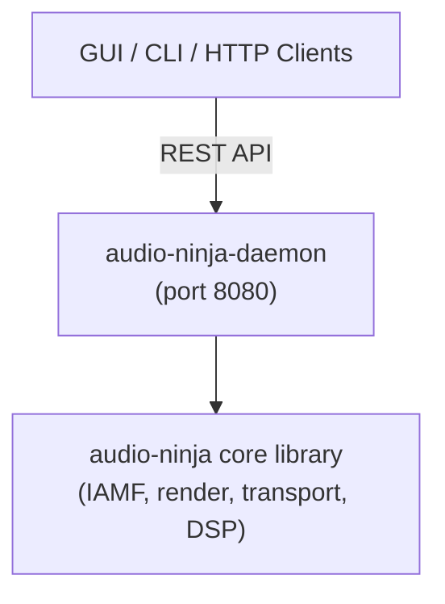
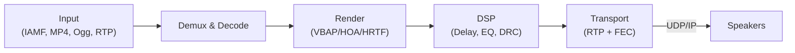

# Audio Ninja 🥷

[](LICENSE)
[](https://www.rust-lang.org/)
[](https://github.com/mr-u0b0dy/audio-ninja/actions)
[](https://github.com/mr-u0b0dy/audio-ninja/actions)
[](https://codecov.io/gh/mr-u0b0dy/audio-ninja)

**Audio Ninja** is an open-source wireless immersive audio platform with IAMF-first architecture, flexible speaker layouts, networked transport with sync, DSP processing, and room calibration.

## 🎯 Key Features

- **IAMF Rendering**: Object/channel/scene-based immersive audio parsing and rendering
- **3D Spatial Audio**: VBAP (3D vectors), HOA decoder (1st-3rd order), HRTF binaural
- **Network Transport**: UDP/RTP with PTP/NTP sync, mDNS discovery, Forward Error Correction
- **Room Calibration**: Automatic measurement, impulse response analysis, filter design
- **Flexible Layouts**: 2.0 stereo through 9.1.6+ with arbitrary speaker positioning
- **DSP Pipeline**: Loudness (ITU-R BS.1770), DRC, per-speaker processing
- **Control Interfaces**: REST API (port 8080), BLE GATT, CLI, Tauri GUI
- **Production-Ready**: 250+ tests, benchmarks, fuzzing, cross-platform CI

## 🚀 Quick Start

### Prerequisites
- Rust 1.70+
- Linux: `webkit2gtk-4.0`, `gtk3`, `openssl`
- macOS: `pkg-config`, `openssl`

### Installation

```bash
git clone https://github.com/mr-u0b0dy/audio-ninja.git
cd audio-ninja

# VS Code DevContainer (recommended)
code .  # Ctrl+Shift+P → "Dev Containers: Reopen in Container"

# Or manual setup
./scripts/dev-setup.sh
cargo build --workspace --release
```

### Essential Commands

```bash
# Pre-commit checks (local)
Ctrl+Shift+B                                   # VS Code default task
cargo fmt --all && cargo clippy --workspace && cargo test --workspace

# Run components
cargo run -p audio-ninja-daemon --release      # Start API (port 8080)
cargo run -p audio-ninja-cli --release -- status  # Query status
cargo run -p audio-ninja-gui --release         # Launch GUI

# Testing & benchmarks
cargo test --workspace
cargo bench -p audio-ninja --bench main_benchmarks
```

## 📖 Documentation

Core documentation is in the [docs/](docs/) directory:

| File | Topic |
|------|-------|
| [docs/daemon_workflow.md](docs/daemon_workflow.md) | Deployment, configuration, operation |
| [docs/calibration.md](docs/calibration.md) | Room measurement and optimization |
| [docs/api_usage.md](docs/api_usage.md) | REST API examples |
| [docs/vbap.md](docs/vbap.md) | 3D Vector-Based Amplitude Panning |
| [docs/hoa.md](docs/hoa.md) | Higher-Order Ambisonics |
| [docs/hrtf.md](docs/hrtf.md) | Binaural HRTF rendering |
| [docs/loudness_drc.md](docs/loudness_drc.md) | Loudness and dynamic range control |
| [docs/codec_integration.md](docs/codec_integration.md) | Audio codec support |
| [docs/firmware_update.md](docs/firmware_update.md) | OTA firmware updates |
| [docs/release.md](docs/release.md) | Release process |

Component READMEs:
- [crates/daemon/README.md](crates/daemon/README.md) - Daemon service
- [crates/cli/README.md](crates/cli/README.md) - CLI tool
- [crates/core/README.md](crates/core/src) - Core library

## 🏗️ Architecture

Audio Ninja uses a modular Cargo workspace with client-server architecture:



**Crates:**
- `crates/core/` - IAMF, VBAP, HOA, HRTF, transport, DSP, calibration
- `crates/daemon/` - REST API service (Axum)
- `crates/cli/` - Command-line interface
- `crates/gui/` - Desktop client (Tauri)

### Processing Pipeline



## ✨ Status

**Completed**: IAMF rendering, spatial audio (VBAP/HOA/HRTF), RTP transport, clock sync, FEC, calibration, REST API, CLI, GUI, 250+ tests, benchmarks, CI/CD, cross-platform support.

**In Progress**: Real libiamf decoder, FFmpeg codecs, GUI completeness.

**Planned**: RTSP, adaptive bitrate, firmware OTA, Python bindings, Windows support.

## 🤝 Contributing

See [CONTRIBUTING.md](CONTRIBUTING.md) for guidelines and [.github/copilot-instructions.md](.github/copilot-instructions.md) for development standards.

### Development

```bash
# Setup
./scripts/dev-setup.sh

# Pre-commit validation
Ctrl+Shift+B  # VS Code task
# Or manually:
cargo fmt --all -- --check && \
cargo clippy --workspace --all-targets -- -D warnings && \
cargo test --workspace -- --skip e2e_ && \
cargo doc --workspace
```

## 📜 License

Apache License 2.0 - see [LICENSE](LICENSE)

