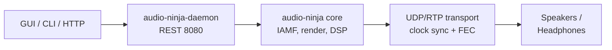

# Audio Ninja 🥷


[](LICENSE)
[](https://www.rust-lang.org/)
[](https://github.com/mr-u0b0dy/audio-ninja/actions)
[](https://codecov.io/gh/mr-u0b0dy/audio-ninja)

Audio Ninja is an IAMF-first wireless immersive audio platform with a daemon-first engine, thin clients, and a full calibration + DSP pipeline.

## Highlights
- Daemon exposes a REST API on port 8080; GUI (Tauri) and CLI are thin clients
- 3D spatial rendering: IAMF, VBAP, HOA, and HRTF binaural downmix
- UDP/RTP transport with PTP/NTP clock sync, jitter buffer, and XOR FEC
- Calibration and DSP: sweeps, IR analysis, delays, trims, EQ, loudness, and DRC
- Built-in discovery (mDNS), BLE control plane, and flexible speaker layouts (2.0 to 9.1.6+)
- CI-backed workspace with fuzzing, benches, and 250+ tests

## Architecture


## Quick Start
- Prerequisites: Rust 1.70+, Linux GUI deps (`webkit2gtk-4.0`, `gtk3`, `openssl`)

```bash
git clone https://github.com/mr-u0b0dy/audio-ninja.git
cd audio-ninja
./scripts/dev-setup.sh    # installs deps, builds workspace
cargo run -p audio-ninja-daemon --release
cargo run -p audio-ninja-cli --release -- status
```

## Workspace Commands
- make dev - fmt + clippy + tests
- make run-daemon - launch daemon
- make run-gui - launch Tauri GUI

## Documentation
- Daemon quick start: [crates/daemon/README.md](crates/daemon/README.md)
- CLI usage: [crates/cli/README.md](crates/cli/README.md)
- REST examples and workflow: [docs/](docs)
- VuePress docs site: [docs-site/src/](docs-site/src)

## Status
- Completed: IAMF pipeline, VBAP/HOA/HRTF, calibration + DSP, UDP/RTP transport, CLI/GUI clients
- In progress: libiamf/AOM integration, FFmpeg bindings, expanded GUI features

## License

Apache License 2.0. See LICENSE for details.
