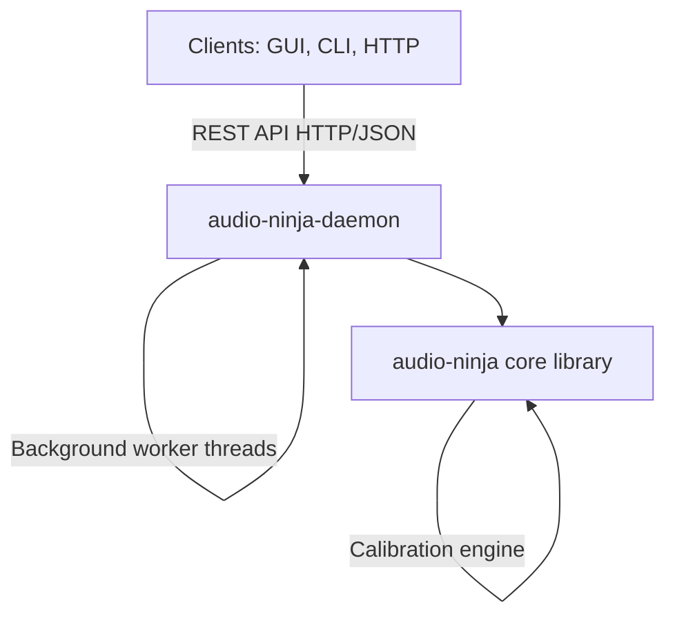

# Audio Ninja Daemon

Background service providing the core audio engine for Audio Ninja.

## Overview

The daemon runs as a system service and exposes a REST API on `http://127.0.0.1:8080/api/v1`.  
The GUI and CLI tools communicate with this service for all audio processing operations.

## API Documentation

- **[REST API Usage Examples](../../docs/API_USAGE.md)**: Complete HTTP API guide with curl, Python, JavaScript, and Rust examples
- **[Daemon Workflow Guide](../../docs/DAEMON_WORKFLOW.md)**: Deployment, configuration, monitoring, and integration
- **[Calibration Workflow](../../docs/CALIBRATION.md)**: Room calibration and acoustic optimization
- **API Reference**: See [API.md](API.md) for complete endpoint documentation
- **OpenAPI Spec**: See [openapi.yaml](openapi.yaml) for machine-readable API specification
- **CLI Usage**: See [../cli/README.md](../cli/README.md) for command-line interface

## Architecture



## Building

```bash
# From workspace root
cargo build -p audio-ninja-daemon --release

# Or from this directory
cd crates/daemon
cargo build --release
```

Binary: `../../target/release/audio-ninja-daemon`

## Running

### Development Mode

```bash
cargo run --release -- --verbose
```

### Production Mode

```bash
./audio-ninja-daemon --bind 127.0.0.1 --port 8080
```

### As System Service (Linux)

```bash
# Copy binary (from workspace root)
sudo cp target/release/audio-ninja-daemon /usr/local/bin/

# Create service user
sudo useradd -r -s /bin/false -G audio audio-ninja

# Create state directory
sudo mkdir -p /var/lib/audio-ninja
sudo chown audio-ninja:audio /var/lib/audio-ninja

# Install systemd service
sudo cp crates/daemon/audio-ninja-daemon.service /etc/systemd/system/
sudo systemctl daemon-reload
sudo systemctl enable audio-ninja-daemon
sudo systemctl start audio-ninja-daemon

# Check status
sudo systemctl status audio-ninja-daemon
sudo journalctl -u audio-ninja-daemon -f
```

## API Reference

Base URL: `http://127.0.0.1:8080/api/v1`

### Status & Info

- **GET** `/status` - Daemon status and uptime
- **GET** `/info` - Version and feature list

### Speaker Management

- **GET** `/speakers` - List all discovered speakers
- **POST** `/speakers/discover` - Start speaker discovery
- **GET** `/speakers/:id` - Get single speaker info
- **DELETE** `/speakers/:id` - Remove speaker

### Layout Configuration

- **GET** `/layout` - Get current speaker layout
- **POST** `/layout` - Set layout from preset or custom positions
  ```json
  { "preset": "stereo" | "5.1" | "7.1.4" }
  ```

### Transport Control

- **POST** `/transport/play` - Start playback
- **POST** `/transport/pause` - Pause playback
- **POST** `/transport/stop` - Stop playback
- **GET** `/transport/status` - Current transport state

### Calibration

- **POST** `/calibration/start` - Begin room calibration
- **GET** `/calibration/status` - Calibration progress
- **POST** `/calibration/apply` - Apply calibration results

### Statistics

- **GET** `/stats` - System-wide statistics
- **GET** `/speakers/:id/stats` - Per-speaker stats (latency, jitter, packet loss)

## Configuration

Command-line options:

```
-p, --port <PORT>      HTTP API port [default: 8080]
-b, --bind <ADDRESS>   Bind address [default: 127.0.0.1]
-v, --verbose          Enable verbose logging
```

## Security

By default, the daemon binds to `127.0.0.1` (localhost only). To allow network access:

```bash
./audio-ninja-daemon --bind 0.0.0.0 --port 8080
```

**Warning**: Exposing the API to the network allows any client to control your audio system.  
Consider using a reverse proxy with authentication for production deployments.

## Development

### Adding New Endpoints

1. Define handler in `src/api.rs`
2. Add route in `src/main.rs`
3. Update engine state in `src/engine.rs` if needed

### Testing

```bash
# Start daemon
cargo run -- --verbose

# Test endpoint
curl http://127.0.0.1:8080/api/v1/status

# Discover speakers
curl -X POST http://127.0.0.1:8080/api/v1/speakers/discover

# Get speakers
curl http://127.0.0.1:8080/api/v1/speakers
```

## Future Plans

### Phase 2: GUI Enhancement (5 weeks)
The daemon API is production-ready. Phase 2 focuses on expanding GUI capabilities:
- I/O device selection and routing
- Transport mode controls (file/stream/mixed)
- Real-time stats dashboard
- Layout visualization

No daemon changes required for Phase 2 — all endpoints are functional.

### Phase 3: Audio Backend Implementation (3-4 months)
The daemon currently supports the architecture layer. Phase 3 adds real audio I/O backends:

**ALSA** (Linux): Real PCM I/O via ALSA device drivers  
**PulseAudio**: System audio routing and app-specific routing  
**CoreAudio** (macOS): Native macOS audio system integration  
**FFmpeg**: Multi-codec support (Opus, AAC, FLAC, AC-3, E-AC-3, TrueHD)  

These bindings will connect to the existing `InputManager`/`OutputManager` traits in `crates/core/`.

See [../../.github/copilot-instructions.md](../../.github/copilot-instructions.md#phase-3-backend-audio-io-implementation-production-ready) for detailed breakdown.

## License

Apache-2.0
