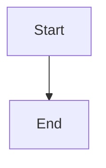

# Audio Ninja Documentation Site (VuePress + Theme Hope)

<div align="center">


</div>

VuePress documentation site for Audio Ninja wireless immersive audio platform.

## Setup

### Prerequisites

- Node.js 18+ and npm
- VuePress 2.x
- VuePress Theme Hope 2.x

### Installation

```bash
cd docs-site
npm install
```

## Development

### Start Development Server

```bash
npm run docs:dev
```

The site will be available at `http://localhost:8080`

Hot-reload is enabled for development changes.

## Build

### Production Build

```bash
npm run docs:build
```

Output is in `src/.vuepress/dist/`

### Clean Cache

```bash
npm run docs:clean
```

## Documentation Structure

```
docs-site/src/
├── api/                      # API reference and workflow guides
│   ├── reference.md          # REST API endpoint reference
│   ├── api_usage.md          # API usage examples (curl, Python, JS, Rust)
│   ├── daemon_workflow.md    # Daemon deployment and integration guide
│   └── release.md            # Release process documentation
├── guide/                    # Getting started and user guides
│   ├── quick-start.md        # Quick start guide
│   ├── installation.md       # Installation instructions
│   ├── configuration.md      # Daemon configuration guide
│   ├── cli-tui.md            # CLI and TUI usage guide
│   ├── tui.md                # Terminal UI detailed guide
│   └── gui-quick-reference.md # GUI quick reference
├── design/                   # GUI design and implementation
│   ├── design-system.md      # Magma Orange design system
│   └── phase2-tasks.md       # 43 Phase 2 implementation tasks
├── spatial/                  # Spatial audio processing
│   ├── overview.md           # 3D spatial audio overview
│   ├── vbap.md               # VBAP (Vector Base Amplitude Panning)
│   ├── hoa.md                # HOA (Higher-Order Ambisonics)
│   ├── hrtf.md               # HRTF (Head-Related Transfer Function)
│   └── comparison.md         # Spatial rendering comparison
└── processing/               # DSP and audio processing
    ├── calibration.md        # Room calibration workflow
    ├── loudness.md           # Loudness normalization (ITU-R BS.1770)
    ├── drc.md                # Dynamic Range Control
    ├── codecs.md             # Codec support and formats
    ├── codec_integration.md  # FFmpeg and codec integration guide
    └── firmware_update.md    # Firmware update mechanism
```
    ├── README.md             # Home page
    ├── guide/                # Getting Started section
    │   ├── README.md
    │   ├── quick-start.md
    │   ├── installation.md
    │   └── configuration.md
    ├── spatial/              # Spatial Audio section
    │   ├── overview.md
    │   ├── vbap.md
    │   ├── hoa.md
    │   ├── hrtf.md
    │   └── comparison.md
    ├── processing/           # Audio Processing section
    │   ├── loudness.md
    │   ├── drc.md
    │   ├── calibration.md
    │   └── codecs.md
    ├── deployment/           # Deployment section
    │   ├── daemon.md
    │   ├── api.md
    │   ├── cli.md
    │   ├── firmware.md
    │   └── release.md
    └── .vuepress/
        ├── config.ts         # VuePress configuration
        └── dist/             # Built site (generated)
```

## Configuration

### VuePress Config (`src/.vuepress/config.ts`)

Key settings:

```typescript
export default defineUserConfig({
  base: "/audio-ninja/",        // Deployment base path
  lang: "en-US",
  title: "Audio Ninja",
  theme: hopeTheme({
    navbar: [...],               // Top navigation
    sidebar: {...},              // Side navigation
    plugins: {...},              // Theme plugins
  }),
});
```

### Theme Configuration

- **Logo**: Add image to `src/.vuepress/public/logo.svg`
- **Navigation**: Edit navbar config in `config.ts`
- **Sidebar**: Edit sidebar config in `config.ts`
- **Footer**: Customize in theme config

## GitHub Pages Deployment

### Automatic Deployment

Push to `docs/vuepress-theme-hope` branch:

```bash
git checkout docs/vuepress-theme-hope
git push origin docs/vuepress-theme-hope
```

GitHub Actions workflow (`.github/workflows/docs-deploy.yml`) will:
1. Install dependencies
2. Build the VuePress site
3. Deploy to GitHub Pages

**Site URL**: `https://mr-u0b0dy.github.io/audio-ninja/`

### Manual Deployment

```bash
# Build site
npm run docs:build

# Deploy to GitHub Pages (requires gh-pages package)
npm install gh-pages --save-dev
npx gh-pages -d src/.vuepress/dist -b gh-pages
```

## Writing Documentation

### Markdown Features

VuePress Theme Hope supports:

- **Callouts**: :::info, :::warning, :::danger, :::success
- **Code Blocks**: Syntax highlighting with line numbers
- **Charts**: Mermaid diagrams
- **Tabs**: Tabbed content
- **Components**: Custom Vue components

### Example Callout

```markdown
:::warning Important
This is a warning message.
:::

:::success Completed
This is a success message.
:::
```

### Example Code Block

````markdown
```rust
// Rust code with syntax highlighting
fn main() {
    println!("Hello, world!");
}
```
````

### Example Diagram

````markdown

````

## Customization

### Adding New Pages

1. Create markdown file in appropriate section
2. Add to navbar/sidebar config if needed
3. Build and deploy

### Color Palette

Current palette (Dark Orange/Magma theme):
- Void Black (Background): #050203
- Deep Bronze (Cards/Sidebars): #26140D
- Magma Orange (Primary): #E65100
- Neon Amber (Accents): #FF8C00
- Blade Glow (Highlights): #FFD580
- Mist White (Text): #F5F5F5

Update `src/.vuepress/config.ts` if you need to change it:

```typescript
theme: hopeTheme({
  themeColor: {
    "#E65100": "Magma Orange",
    "#FF8C00": "Neon Amber",
    "#FFD580": "Blade Glow",
  },
})
```

### Adding Custom CSS

Create `src/.vuepress/styles/index.scss`:

```scss
// Custom styles
```

## Documentation Organization

All documentation is self-contained in `docs-site/src/` with the following structure:

- `guide/` - Getting started, installation, configuration
- `spatial/` - VBAP, HOA, HRTF spatial rendering
- `processing/` - Calibration, codecs, loudness, DRC
- `api/` - REST API reference
- `deployment/` - Deployment and production guides
- `reference/` - Architecture and technical details

## Troubleshooting

### Build Errors

```bash
# Clear node_modules and reinstall
rm -rf node_modules package-lock.json
npm install
```

### Port Already in Use

```bash
# Use different port
npm run docs:dev -- --port 9000
```

### Git Issues with GitHub Pages

```bash
# Check GitHub Pages settings in repository
# Settings → Pages → Source should be "GitHub Actions"
```

## Performance

VuePress Theme Hope provides:

- ⚡ Fast dev server with HMR
- 📦 Optimized production builds
- 🔍 Built-in search functionality
- 📱 Mobile-responsive design
- ♿ Accessible markup

## See Also

- [VuePress Documentation](https://v2.vuepress.vuejs.org/)
- [Theme Hope Documentation](https://theme-hope.vuejs.press/)
- [GitHub Pages Docs](https://docs.github.com/en/pages)
- [Main Audio Ninja Repository](https://github.com/mr-u0b0dy/audio-ninja)

## License

Apache 2.0 - Same as Audio Ninja project
