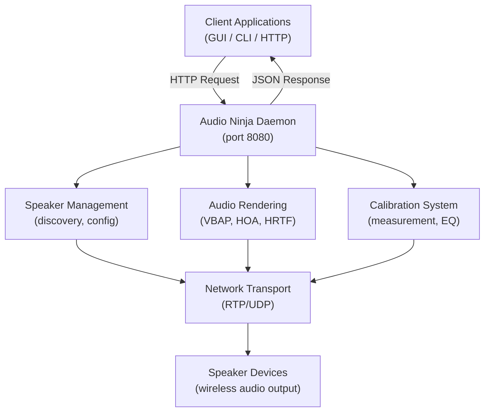

# REST API Usage Examples

This guide provides practical examples for interacting with the Audio Ninja daemon REST API.

## API Flow



## Table of Contents

- [Quick Start](#quick-start)
- [Status & Info](#status--info)
- [Speaker Management](#speaker-management)
- [Layout Configuration](#layout-configuration)
- [Transport Control](#transport-control)
- [Calibration](#calibration)
- [Error Handling](#error-handling)
- [Client Libraries](#client-libraries)

## Quick Start

The daemon exposes a REST API on `http://127.0.0.1:8080/api/v1`.

### Starting the Daemon

```bash
# Development mode with verbose logging
cargo run -p audio-ninja-daemon --release -- --verbose

# Production mode
./audio-ninja-daemon --bind 127.0.0.1 --port 8080

# As systemd service
sudo systemctl start audio-ninja-daemon
```

### Health Check

```bash
curl http://127.0.0.1:8080/api/v1/status
```

Expected response:
```json
{
  "status": "running",
  "uptime_seconds": 42,
  "version": "0.1.0"
}
```

## Status & Info

### Get Daemon Status

```bash
curl http://127.0.0.1:8080/api/v1/status
```

Response:
```json
{
  "status": "running",
  "uptime_seconds": 3600,
  "version": "0.1.0"
}
```

### Get Daemon Info

```bash
curl http://127.0.0.1:8080/api/v1/info
```

Response:
```json
{
  "version": "0.1.0",
  "features": ["iamf", "rtp", "ble", "calibration", "vbap", "hoa", "hrtf"]
}
```

## Speaker Management

### List All Speakers

```bash
curl http://127.0.0.1:8080/api/v1/speakers
```

Response:
```json
{
  "speakers": [
    {
      "id": "speaker-001",
      "name": "Front Left",
      "address": "192.168.1.101",
      "status": "online",
      "latency_ms": 5.2
    },
    {
      "id": "speaker-002",
      "name": "Front Right",
      "address": "192.168.1.102",
      "status": "online",
      "latency_ms": 5.3
    }
  ]
}
```

### Get Speaker Details

```bash
curl http://127.0.0.1:8080/api/v1/speakers/speaker-001
```

Response:
```json
{
  "id": "speaker-001",
  "name": "Front Left",
  "address": "192.168.1.101",
  "port": 5004,
  "status": "online",
  "capabilities": ["pcm", "opus"],
  "latency_ms": 5.2,
  "position": {
    "azimuth": 330.0,
    "elevation": 0.0,
    "distance": 2.5
  }
}
```

### Register New Speaker

```bash
curl -X POST http://127.0.0.1:8080/api/v1/speakers \
  -H "Content-Type: application/json" \
  -d '{
    "id": "speaker-003",
    "name": "Center",
    "address": "192.168.1.103",
    "port": 5004,
    "position": {
      "azimuth": 0.0,
      "elevation": 0.0,
      "distance": 2.5
    }
  }'
```

Response:
```json
{
  "id": "speaker-003",
  "status": "registered"
}
```

### Update Speaker Configuration

```bash
curl -X PUT http://127.0.0.1:8080/api/v1/speakers/speaker-003 \
  -H "Content-Type: application/json" \
  -d '{
    "name": "Center Channel",
    "position": {
      "azimuth": 0.0,
      "elevation": 10.0,
      "distance": 2.8
    }
  }'
```

Response:
```json
{
  "id": "speaker-003",
  "status": "updated"
}
```

### Delete Speaker

```bash
curl -X DELETE http://127.0.0.1:8080/api/v1/speakers/speaker-003
```

Response:
```json
{
  "id": "speaker-003",
  "status": "deleted"
}
```

## Layout Configuration

### Get Current Layout

```bash
curl http://127.0.0.1:8080/api/v1/layout
```

Response:
```json
{
  "type": "5.1",
  "speakers": [
    {"id": "speaker-001", "channel": "FrontLeft"},
    {"id": "speaker-002", "channel": "FrontRight"},
    {"id": "speaker-003", "channel": "Center"},
    {"id": "speaker-004", "channel": "LFE"},
    {"id": "speaker-005", "channel": "SurroundLeft"},
    {"id": "speaker-006", "channel": "SurroundRight"}
  ]
}
```

### Set Layout Preset

```bash
curl -X POST http://127.0.0.1:8080/api/v1/layout \
  -H "Content-Type: application/json" \
  -d '{
    "type": "7.1.4",
    "mapping": "auto"
  }'
```

Response:
```json
{
  "type": "7.1.4",
  "status": "configured",
  "speakers_mapped": 12
}
```

### Custom Layout Configuration

```bash
curl -X POST http://127.0.0.1:8080/api/v1/layout/custom \
  -H "Content-Type: application/json" \
  -d '{
    "speakers": [
      {
        "id": "speaker-001",
        "position": {"azimuth": 330.0, "elevation": 0.0, "distance": 2.5},
        "channel": "FrontLeft"
      },
      {
        "id": "speaker-002",
        "position": {"azimuth": 30.0, "elevation": 0.0, "distance": 2.5},
        "channel": "FrontRight"
      }
    ]
  }'
```

Response:
```json
{
  "type": "custom",
  "status": "configured",
  "speakers": 2
}
```

## Transport Control

### Start Streaming

```bash
curl -X POST http://127.0.0.1:8080/api/v1/transport/start \
  -H "Content-Type: application/json" \
  -d '{
    "source": "/path/to/audio.mp4",
    "format": "iamf",
    "transport": "rtp",
    "multicast": false
  }'
```

Response:
```json
{
  "session_id": "session-abc123",
  "status": "streaming",
  "bitrate_kbps": 256,
  "sample_rate": 48000
}
```

### Stop Streaming

```bash
curl -X POST http://127.0.0.1:8080/api/v1/transport/stop \
  -H "Content-Type: application/json" \
  -d '{
    "session_id": "session-abc123"
  }'
```

Response:
```json
{
  "session_id": "session-abc123",
  "status": "stopped"
}
```

### Get Transport Status

```bash
curl http://127.0.0.1:8080/api/v1/transport/status
```

Response:
```json
{
  "active_sessions": 1,
  "sessions": [
    {
      "session_id": "session-abc123",
      "status": "streaming",
      "duration_seconds": 120,
      "packets_sent": 24000,
      "packets_lost": 12,
      "jitter_ms": 0.8,
      "bitrate_kbps": 256
    }
  ]
}
```

## Calibration

### Start Calibration

```bash
curl -X POST http://127.0.0.1:8080/api/v1/calibration/start \
  -H "Content-Type: application/json" \
  -d '{
    "method": "sweep",
    "microphone": "default",
    "speakers": ["speaker-001", "speaker-002"]
  }'
```

Response:
```json
{
  "calibration_id": "cal-xyz789",
  "status": "measuring",
  "progress": 0,
  "estimated_time_seconds": 60
}
```

### Get Calibration Status

```bash
curl http://127.0.0.1:8080/api/v1/calibration/cal-xyz789
```

Response:
```json
{
  "calibration_id": "cal-xyz789",
  "status": "analyzing",
  "progress": 75,
  "measurements_complete": 3,
  "measurements_total": 4
}
```

### Get Calibration Results

```bash
curl http://127.0.0.1:8080/api/v1/calibration/cal-xyz789/results
```

Response:
```json
{
  "calibration_id": "cal-xyz789",
  "status": "complete",
  "speakers": [
    {
      "id": "speaker-001",
      "delay_ms": 5.2,
      "gain_db": -2.5,
      "eq": [
        {"freq": 100, "gain": 2.0, "q": 0.7},
        {"freq": 1000, "gain": -1.5, "q": 1.0}
      ]
    }
  ]
}
```

### Apply Calibration

```bash
curl -X POST http://127.0.0.1:8080/api/v1/calibration/cal-xyz789/apply \
  -H "Content-Type: application/json" \
  -d '{
    "verify": true
  }'
```

Response:
```json
{
  "calibration_id": "cal-xyz789",
  "status": "applied",
  "speakers_updated": 6
}
```

### Export Calibration

```bash
curl http://127.0.0.1:8080/api/v1/calibration/cal-xyz789/export?format=camilladsp
```

Response: CamillaDSP YAML configuration file (as text/yaml)

## Error Handling

All API endpoints return standard HTTP status codes and JSON error responses.

### Success Responses

- `200 OK` - Request succeeded
- `201 Created` - Resource created successfully
- `204 No Content` - Request succeeded with no response body

### Error Responses

- `400 Bad Request` - Invalid request format or parameters
- `404 Not Found` - Resource not found
- `409 Conflict` - Resource already exists or conflict
- `500 Internal Server Error` - Server error
- `503 Service Unavailable` - Daemon not ready

Example error response:
```json
{
  "error": "speaker_not_found",
  "message": "Speaker with ID 'speaker-999' does not exist",
  "code": 404
}
```

### Error Handling in curl

```bash
# Check HTTP status code
if ! curl -f http://127.0.0.1:8080/api/v1/speakers/invalid 2>/dev/null; then
  echo "Request failed"
fi

# Capture and parse error response
response=$(curl -s http://127.0.0.1:8080/api/v1/speakers/invalid)
if echo "$response" | jq -e '.error' >/dev/null 2>&1; then
  error=$(echo "$response" | jq -r '.error')
  message=$(echo "$response" | jq -r '.message')
  echo "Error: $error - $message"
fi
```

## Client Libraries

### Python with requests

```python
import requests

BASE_URL = "http://127.0.0.1:8080/api/v1"

# Get daemon status
response = requests.get(f"{BASE_URL}/status")
status = response.json()
print(f"Daemon status: {status['status']}")

# Register speaker
speaker_data = {
    "id": "speaker-007",
    "name": "Subwoofer",
    "address": "192.168.1.107",
    "port": 5004,
    "position": {"azimuth": 0.0, "elevation": -30.0, "distance": 3.0}
}
response = requests.post(f"{BASE_URL}/speakers", json=speaker_data)
print(f"Speaker registered: {response.json()}")

# Error handling
try:
    response = requests.get(f"{BASE_URL}/speakers/invalid")
    response.raise_for_status()
except requests.HTTPError as e:
    error = response.json()
    print(f"Error: {error['message']}")
```

### JavaScript/Node.js with fetch

```javascript
const BASE_URL = "http://127.0.0.1:8080/api/v1";

// Get daemon status
async function getStatus() {
  const response = await fetch(`${BASE_URL}/status`);
  const status = await response.json();
  console.log(`Daemon status: ${status.status}`);
}

// Register speaker
async function registerSpeaker(speakerData) {
  const response = await fetch(`${BASE_URL}/speakers`, {
    method: "POST",
    headers: { "Content-Type": "application/json" },
    body: JSON.stringify(speakerData),
  });
  
  if (!response.ok) {
    const error = await response.json();
    throw new Error(`API error: ${error.message}`);
  }
  
  return await response.json();
}

// Usage
getStatus();
registerSpeaker({
  id: "speaker-008",
  name: "Height Left",
  address: "192.168.1.108",
  port: 5004,
  position: { azimuth: 330.0, elevation: 45.0, distance: 2.5 }
}).then(result => console.log("Speaker registered:", result))
  .catch(err => console.error("Error:", err.message));
```

### Rust with reqwest

```rust
use reqwest;
use serde::{Deserialize, Serialize};

const BASE_URL: &str = "http://127.0.0.1:8080/api/v1";

#[derive(Deserialize)]
struct Status {
    status: String,
    uptime_seconds: u64,
    version: String,
}

#[derive(Serialize)]
struct SpeakerRegistration {
    id: String,
    name: String,
    address: String,
    port: u16,
    position: Position,
}

#[derive(Serialize)]
struct Position {
    azimuth: f32,
    elevation: f32,
    distance: f32,
}

#[tokio::main]
async fn main() -> Result<(), Box<dyn std::error::Error>> {
    let client = reqwest::Client::new();
    
    // Get daemon status
    let status: Status = client
        .get(format!("{}/status", BASE_URL))
        .send()
        .await?
        .json()
        .await?;
    println!("Daemon status: {}", status.status);
    
    // Register speaker
    let speaker = SpeakerRegistration {
        id: "speaker-009".to_string(),
        name: "Height Right".to_string(),
        address: "192.168.1.109".to_string(),
        port: 5004,
        position: Position {
            azimuth: 30.0,
            elevation: 45.0,
            distance: 2.5,
        },
    };
    
    let response = client
        .post(format!("{}/speakers", BASE_URL))
        .json(&speaker)
        .send()
        .await?;
    
    if response.status().is_success() {
        println!("Speaker registered successfully");
    } else {
        eprintln!("Error: {}", response.status());
    }
    
    Ok(())
}
```

## Batch Operations

### Register Multiple Speakers

```bash
#!/bin/bash

BASE_URL="http://127.0.0.1:8080/api/v1"

# Define speakers in JSON array
speakers='[
  {
    "id": "speaker-fl",
    "name": "Front Left",
    "address": "192.168.1.101",
    "port": 5004,
    "position": {"azimuth": 330.0, "elevation": 0.0, "distance": 2.5}
  },
  {
    "id": "speaker-fr",
    "name": "Front Right",
    "address": "192.168.1.102",
    "port": 5004,
    "position": {"azimuth": 30.0, "elevation": 0.0, "distance": 2.5}
  },
  {
    "id": "speaker-c",
    "name": "Center",
    "address": "192.168.1.103",
    "port": 5004,
    "position": {"azimuth": 0.0, "elevation": 0.0, "distance": 2.5}
  }
]'

# Register each speaker
echo "$speakers" | jq -c '.[]' | while read -r speaker; do
  speaker_id=$(echo "$speaker" | jq -r '.id')
  echo "Registering $speaker_id..."
  
  response=$(curl -s -X POST "$BASE_URL/speakers" \
    -H "Content-Type: application/json" \
    -d "$speaker")
  
  if echo "$response" | jq -e '.status == "registered"' >/dev/null; then
    echo "✓ $speaker_id registered"
  else
    echo "✗ $speaker_id failed: $(echo "$response" | jq -r '.message')"
  fi
done
```

## See Also

- [Daemon README](../crates/daemon/README.md) - Daemon overview and setup
- [CLI README](../crates/cli/README.md) - Command-line interface usage
- [API Reference](../api.md) - Complete endpoint documentation
- [OpenAPI Spec](../crates/daemon/openapi.yaml) - Machine-readable API specification
