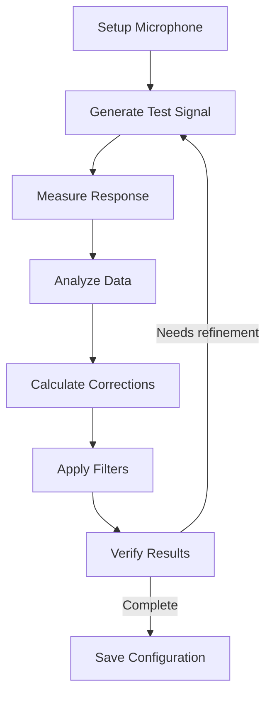

# Calibration Workflow Guide

Complete guide for room calibration, acoustic measurement, and system optimization in Audio Ninja.

## Table of Contents

- [Overview](#overview)
- [Prerequisites](#prerequisites)
- [Calibration Methods](#calibration-methods)
- [Step-by-Step Workflows](#step-by-step-workflows)
- [Advanced Configuration](#advanced-configuration)
- [Analysis and Tuning](#analysis-and-tuning)
- [DSP Integration](#dsp-integration)
- [Troubleshooting](#troubleshooting)

## Overview

Audio Ninja's calibration system automatically measures and corrects:

- **Time Alignment**: Per-speaker delays for synchronized arrival
- **Level Matching**: Gain adjustments for consistent SPL
- **Frequency Response**: Parametric EQ to flatten response
- **Phase Alignment**: Crossover optimization (future)

### Calibration Flow



## Prerequisites

### Hardware Requirements

**Measurement Microphone**
- Calibrated measurement mic (e.g., UMIK-1, UMIK-2, Dayton EMM-6)
- USB audio interface with 48kHz+ sampling
- Mic stand or tripod
- Quiet environment (< 40 dB SPL ambient)

**Speaker System**
- All speakers connected and powered
- Network connectivity verified
- Adequate amplifier headroom (avoid clipping)

### Software Setup

```bash
# Install Audio Ninja
cargo build -p audio-ninja-daemon --release

# Start daemon
audio-ninja-daemon --verbose

# Verify microphone is detected
arecord -l  # Linux
system_profiler SPAudioDataType  # macOS

# Test microphone input
arecord -D hw:1,0 -f S16_LE -r 48000 -c 1 test.wav
aplay test.wav
```

### Room Preparation

1. **Positioning**: Place mic at primary listening position
   - Head height (ear level when seated)
   - Away from walls (> 1 meter)
   - Centered in listening area

2. **Environment**: 
   - Close windows/doors
   - Turn off fans, HVAC
   - Minimize background noise
   - Disable other audio devices

3. **SPL Target**: Set initial speaker levels
   - 75-85 dB SPL at listening position
   - Use SPL meter or smartphone app (NIOSH SLM)
   - Avoid clipping amplifiers

## Calibration Methods

### 1. Logarithmic Sweep (Recommended)

**Best for**: Full-range frequency response, impulse response analysis

**Characteristics**:
- Duration: 500ms - 2s
- Frequency range: 20 Hz - 20 kHz
- Excellent SNR, robust to background noise
- Captures linear and nonlinear distortion

```bash
# CLI usage
audio-ninja calibrate start --method sweep --duration 1000
```

### 2. Maximum Length Sequence (MLS)

**Best for**: Fast measurements, high SNR

**Characteristics**:
- Duration: 100ms - 500ms
- Frequency range: 20 Hz - 24 kHz
- Very fast, good for multi-point averaging
- Sensitive to time-variant noise

```bash
# CLI usage
audio-ninja calibrate start --method mls --duration 500
```

### 3. Discrete Tone Bursts

**Best for**: Specific frequency analysis, subwoofer integration

**Characteristics**:
- Test specific frequencies (e.g., 20, 30, 40, 60, 80, 100 Hz)
- Longer integration time
- Best for problematic bass modes

```bash
# CLI usage
audio-ninja calibrate start --method tones --freqs 20,30,40,60,80,100
```

## Step-by-Step Workflows

### Workflow 1: Basic Stereo Calibration

**Goal**: Time-align and level-match stereo pair

```bash
# 1. Start daemon
audio-ninja-daemon --verbose &

# 2. Register speakers
audio-ninja speaker add left --address 192.168.1.101 --name "Left Speaker"
audio-ninja speaker add right --address 192.168.1.102 --name "Right Speaker"

# 3. Set stereo layout
audio-ninja layout set 2.0

# 4. List available microphones
audio-ninja calibrate list-mics

# 5. Start calibration
audio-ninja calibrate start \
  --method sweep \
  --duration 1000 \
  --microphone "USB Audio CODEC" \
  --auto-apply

# 6. View results
audio-ninja calibrate status

# 7. Test playback
audio-ninja transport start test.wav
```

**Expected Results**:
- Delay difference < 0.1ms
- Level difference < 0.5 dB
- Flat response ±3 dB (100 Hz - 10 kHz)

### Workflow 2: Full 5.1 Surround Calibration

**Goal**: Complete room calibration with EQ

```bash
# 1. Register all 6 speakers
for speaker in fl fr c lfe sl sr; do
  audio-ninja speaker add $speaker \
    --address 192.168.1.10X \
    --name "$speaker"
done

# 2. Configure 5.1 layout with positions
audio-ninja layout set 5.1 \
  --fl-position 330,0,2.5 \
  --fr-position 30,0,2.5 \
  --c-position 0,0,2.5 \
  --lfe-position 0,-30,3.0 \
  --sl-position 250,0,2.5 \
  --sr-position 110,0,2.5

# 3. Run multi-point calibration
# Measure at 5 positions: center + 4 corners of listening area
for pos in center left right front back; do
  echo "Position microphone at: $pos"
  read -p "Press Enter when ready..."
  
  audio-ninja calibrate measure \
    --id cal-5.1-$pos \
    --method sweep \
    --duration 1000 \
    --microphone "UMIK-1"
done

# 4. Analyze and average measurements
audio-ninja calibrate analyze \
  --ids cal-5.1-center,cal-5.1-left,cal-5.1-right,cal-5.1-front,cal-5.1-back \
  --averaging spatial-avg \
  --target-curve harman

# 5. Generate filters
audio-ninja calibrate design-filters \
  --max-eq-bands 10 \
  --max-delay-ms 20 \
  --crossover-freq 80 \
  --lfe-lpf 120

# 6. Preview corrections
audio-ninja calibrate preview

# 7. Apply corrections
audio-ninja calibrate apply --verify

# 8. Export for DSP integration
audio-ninja calibrate export \
  --format camilladsp \
  --output /etc/camilladsp/audio-ninja.yml
```

**Expected Results**:
- All speakers time-aligned ±0.5ms
- Level-matched ±0.5 dB at listening position
- Response: ±3 dB (80 Hz - 10 kHz)
- LFE integration smooth at 80 Hz crossover

### Workflow 3: Immersive 7.1.4 with Heights

**Goal**: Full immersive calibration including height channels

```bash
# 1. Register 12 speakers (7.1.4 layout)
# Base layer: FL, FR, C, LFE, SL, SR, BL, BR
# Height layer: TFL, TFR, TBL, TBR

for speaker in fl fr c lfe sl sr bl br tfl tfr tbl tbr; do
  case $speaker in
    tfl|tfr|tbl|tbr) elevation=45 ;;
    lfe) elevation=-30 ;;
    *) elevation=0 ;;
  esac
  
  audio-ninja speaker add $speaker \
    --address 192.168.1.1XX \
    --elevation $elevation
done

# 2. Set 7.1.4 layout
audio-ninja layout set 7.1.4

# 3. Run calibration with all channels
audio-ninja calibrate start \
  --method sweep \
  --duration 1500 \
  --microphone "UMIK-2" \
  --multi-point \
  --averaging spatial-avg \
  --target-curve b&k \
  --eq-resolution 1/3-octave \
  --max-eq-bands 15 \
  --auto-apply

# 4. Verify immersive calibration
audio-ninja calibrate verify --test-pattern circular

# 5. Export results
audio-ninja calibrate export --format report --output calibration-report.pdf
```

**Expected Results**:
- Base layer ±1ms sync
- Height channels ±1.5ms sync relative to base
- Timbral matching across all speakers
- Smooth vertical localization (base ↔ height)
- Immersive sound field with accurate object positioning

### Workflow 4: Subwoofer Integration

**Goal**: Optimize subwoofer crossover, phase, and integration

```bash
# 1. Measure main speakers without subwoofer
audio-ninja calibrate measure \
  --id mains-only \
  --speakers fl,fr \
  --method sweep \
  --duration 1000

# 2. Measure subwoofer independently
audio-ninja calibrate measure \
  --id sub-only \
  --speakers lfe \
  --method sweep \
  --duration 2000 \
  --freq-range 20-200

# 3. Measure mains + subwoofer together
audio-ninja calibrate measure \
  --id mains-sub \
  --speakers fl,fr,lfe \
  --method sweep \
  --duration 1000

# 4. Analyze crossover integration
audio-ninja calibrate analyze-crossover \
  --mains mains-only \
  --sub sub-only \
  --combined mains-sub \
  --crossover-freq 80 \
  --slope 24 \
  --optimize-phase

# 5. Calculate optimal delay and phase
# Audio Ninja finds best delay/phase to minimize cancellation

# 6. Apply subwoofer corrections
audio-ninja calibrate apply-crossover \
  --delay-ms 5.2 \
  --phase-deg 90 \
  --lpf-freq 120 \
  --hpf-freq 80

# 7. Verify integration (look for smooth transition at crossover)
audio-ninja calibrate verify --frequency-range 40-150
```

**Expected Results**:
- Flat response through crossover ±2 dB
- No phase cancellation at crossover frequency
- Smooth transition 60-100 Hz
- Extended low-frequency response (20-80 Hz)

## Advanced Configuration

### Multi-Point Spatial Averaging

Measure at multiple positions to optimize for seating area:

```bash
# Define measurement grid
audio-ninja calibrate grid create \
  --center-x 0 --center-y 0 --center-z 1.0 \
  --spacing 0.3 \
  --points 9

# Measure all points
audio-ninja calibrate grid measure \
  --method sweep \
  --duration 1000

# Average with spatial weighting
audio-ninja calibrate grid analyze \
  --weighting center-weighted \
  --center-weight 2.0
```

### Target Curve Selection

Different target curves for different preferences:

| Target Curve | Description | Use Case |
|--------------|-------------|----------|
| Flat | No EQ, neutral response | Reference monitoring, mixing |
| Harman | Gentle bass/treble lift | Home theater, movies |
| B&K | Slight downward tilt | Music listening, natural |
| X-Curve | High-frequency rolloff | Large cinema rooms |
| Custom | User-defined curve | Specific preferences |

```bash
# Apply target curve
audio-ninja calibrate target-curve set harman

# Create custom target curve
audio-ninja calibrate target-curve custom \
  --points 20:+3,50:+2,100:0,1000:0,10000:-2,20000:-4
```

### Filter Design Options

**FIR Filters (Linear Phase)**
- Pros: Perfect phase, no pre-ringing with minimum-phase variant
- Cons: Higher latency, more CPU
- Use for: Critical listening, studio monitoring

```bash
audio-ninja calibrate design-filters \
  --filter-type fir \
  --taps 8192 \
  --window blackman-harris \
  --phase-mode minimum-phase
```

**IIR Filters (Biquad Cascade)**
- Pros: Low latency, efficient CPU
- Cons: Phase shifts, limited resolution
- Use for: Real-time playback, embedded devices

```bash
audio-ninja calibrate design-filters \
  --filter-type iir \
  --max-bands 10 \
  --q-range 0.5-2.0 \
  --shelf-freq 100,8000
```

### Per-Channel EQ

Fine-tune individual speakers:

```bash
# Measure individual speaker
audio-ninja calibrate measure \
  --id speaker-fl \
  --speakers fl

# Design speaker-specific EQ
audio-ninja calibrate eq design \
  --speaker fl \
  --target-curve flat \
  --max-bands 8 \
  --protect-low-freq  # Don't boost below tuning frequency

# Apply per-speaker corrections
audio-ninja calibrate eq apply --speaker fl
```

## Analysis and Tuning

### View Calibration Results

```bash
# List all calibrations
audio-ninja calibrate list

# Show detailed results
audio-ninja calibrate show cal-5.1-2024-12-28

# View impulse response
audio-ninja calibrate plot impulse --id cal-5.1-2024-12-28 --speaker fl

# View frequency response
audio-ninja calibrate plot magnitude --id cal-5.1-2024-12-28 --overlay all-speakers

# View delay analysis
audio-ninja calibrate plot delay --id cal-5.1-2024-12-28
```

### REST API Analysis

```bash
# Get calibration results
curl http://127.0.0.1:8080/api/v1/calibration/cal-xyz789/results

# Response includes:
# - Per-speaker delay (ms)
# - Per-speaker gain (dB)
# - PEQ bands (frequency, gain, Q)
# - Measured frequency response
# - Target curve
# - Error metrics (RMS error, max deviation)
```

### Interpreting Results

**Good Calibration Indicators**:
- RMS error < 2 dB (80 Hz - 16 kHz)
- Max deviation < ±3 dB
- Smooth response (no sharp peaks/dips)
- Consistent inter-speaker matching ±1 dB

**Problem Indicators**:
- Sharp notches (room modes, reflections)
- Excessive bass boost required (port tuning, placement)
- High-frequency rolloff > 10 kHz (speaker limitation)
- Large delay differences > 5ms (positioning issue)

### Manual Tuning

```bash
# Adjust specific EQ band
audio-ninja calibrate eq adjust \
  --speaker fl \
  --band 3 \
  --freq 120 \
  --gain +2.5 \
  --q 1.0

# Adjust delay
audio-ninja calibrate delay set --speaker sl --delay-ms 7.5

# Adjust gain
audio-ninja calibrate gain set --speaker c --gain-db -1.5

# Recalculate and apply
audio-ninja calibrate apply
```

## DSP Integration

### CamillaDSP Integration

Audio Ninja generates CamillaDSP configuration:

```bash
# Export calibration to CamillaDSP
audio-ninja calibrate export \
  --format camilladsp \
  --output /etc/camilladsp/audio-ninja.yml

# Start CamillaDSP with config
camilladsp /etc/camilladsp/audio-ninja.yml
```

Generated config includes:
- Input/output device configuration
- Per-channel pipeline
- FIR/IIR filters
- Delay compensation
- Gain adjustments
- Crossover filters

### BruteFIR Integration

For convolution-based correction:

```bash
# Export FIR filters
audio-ninja calibrate export \
  --format brutefir \
  --output /etc/brutefir/

# Files generated:
# - brutefir.conf
# - filter-fl.pcm
# - filter-fr.pcm
# - ... (one per speaker)

# Start BruteFIR
brutefir /etc/brutefir/brutefir.conf
```

### JACK/PipeWire Integration

```bash
# Export LADSPA/LV2 filters
audio-ninja calibrate export \
  --format lv2 \
  --output ~/.lv2/audio-ninja-calibration/

# Load in Carla/Ardour/other JACK host
# Or configure PipeWire filter chain
```

### Manual DSP Configuration

Extract raw filter coefficients:

```bash
# Export biquad coefficients (JSON)
audio-ninja calibrate export \
  --format json \
  --output calibration.json

# Example output:
{
  "speakers": {
    "fl": {
      "delay_samples": 250,
      "gain_db": -2.5,
      "biquads": [
        {
          "type": "peaking",
          "freq": 120,
          "gain": 2.5,
          "q": 0.7,
          "b0": 1.002, "b1": -1.995, "b2": 0.993,
          "a1": -1.995, "a2": 0.995
        }
      ]
    }
  }
}
```

## Troubleshooting

### No Microphone Detected

```bash
# Linux: List ALSA devices
arecord -l

# macOS: List audio devices
system_profiler SPAudioDataType

# Verify USB connection
lsusb | grep -i audio

# Test microphone manually
arecord -D hw:1,0 -f S16_LE -r 48000 -c 1 -d 5 test.wav
aplay test.wav
```

### Measurement Clipping

**Symptoms**: Distorted measurements, incorrect EQ

**Solutions**:
```bash
# Reduce speaker output level
audio-ninja speaker set fl --gain-db -6

# Reduce test signal level
audio-ninja calibrate start --test-level -12

# Increase microphone gain in ALSA
alsamixer  # Adjust capture level

# Check for clipping in measurement
audio-ninja calibrate check-clipping --id cal-xyz789
```

### High Background Noise

**Symptoms**: Poor SNR, inconsistent measurements

**Solutions**:
- Turn off HVAC, fans, appliances
- Close windows/doors
- Use longer sweep duration (2000ms)
- Enable noise averaging:

```bash
audio-ninja calibrate start \
  --duration 2000 \
  --averages 5 \
  --snr-threshold 60
```

### Room Modes / Deep Notches

**Symptoms**: Sharp dips in bass response

**Solutions**:
1. **Don't EQ deep notches** (< -10 dB): Wastes headroom, doesn't fix phase
2. **Subwoofer positioning**: Move sub to smooth response
3. **Multi-sub**: Use 2-4 subs with optimized placement
4. **Bass traps**: Add acoustic treatment

```bash
# Limit EQ correction range
audio-ninja calibrate design-filters \
  --max-boost 6 \
  --max-cut 3 \
  --protect-notches  # Don't boost deep nulls
```

### Excessive EQ Required

**Symptoms**: > ±6 dB correction needed

**Solutions**:
1. **Speaker placement**: Move speakers, adjust toe-in
2. **Room treatment**: Add absorption/diffusion
3. **Different speakers**: May not be suitable for room
4. **Lower target**: Accept speaker limitations

```bash
# Use gentler target curve
audio-ninja calibrate target-curve set b&k

# Limit correction range
audio-ninja calibrate design-filters \
  --max-gain 6 \
  --max-cut 6 \
  --smoothing 1/3-octave
```

### Timing Issues / Sync Drift

**Symptoms**: Measurements inconsistent, timing errors

**Solutions**:
```bash
# Check clock sync
audio-ninja sync status

# Use PTP for sample-accurate timing
audio-ninja sync set-source ptp

# Verify audio interface sample rate
audio-ninja calibrate check-sample-rate

# Lock to external clock (if available)
audio-ninja config set-clock-source wordclock
```

## Verification and Testing

### Post-Calibration Tests

```bash
# 1. Verify frequency response
audio-ninja calibrate verify --test frequency-response

# 2. Verify time alignment
audio-ninja calibrate verify --test time-alignment

# 3. Test with pink noise
audio-ninja transport start pink-noise.wav --duration 30

# 4. Test with test tones
audio-ninja transport start test-tones-20-20k.wav

# 5. Test with music
audio-ninja transport start reference-track.flac
```

### A/B Comparison

```bash
# Disable calibration
audio-ninja calibrate bypass on

# Play test content
audio-ninja transport start test.wav

# Enable calibration
audio-ninja calibrate bypass off

# Play same content
audio-ninja transport start test.wav
```

### Export Calibration Report

```bash
# Generate PDF report with plots
audio-ninja calibrate export \
  --format report \
  --include-plots \
  --include-measurements \
  --output calibration-report-2024-12-28.pdf

# Report includes:
# - Before/after frequency response
# - Impulse response
# - Delay corrections
# - EQ bands applied
# - Error metrics
# - Room information
```

## Best Practices

1. **Regular recalibration**: Every 6-12 months or after room changes
2. **Save measurements**: Keep archive of calibrations for comparison
3. **Document changes**: Note room treatment, speaker positions
4. **Version control**: Export configs to version control (git)
5. **Verify after changes**: Re-verify after any system modification

## See Also

- [Daemon Workflow](DAEMON_WORKFLOW.md) - Daemon setup and operation
- [REST API Usage](API_USAGE.md) - API endpoints for calibration
- [DSP Integration](DSP_INTEGRATION.md) - CamillaDSP/BruteFIR setup
- [Acoustic Treatment Guide](ACOUSTIC_TREATMENT.md) - Room optimization tips
