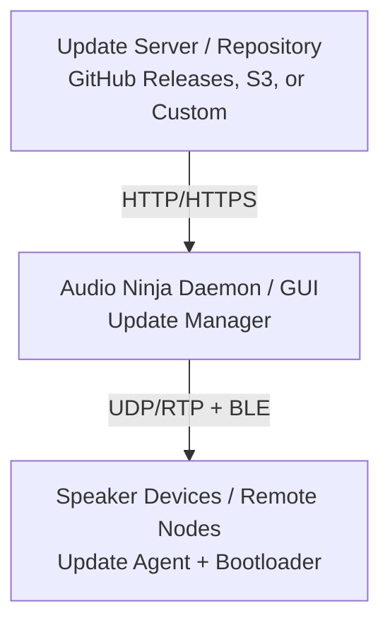

# Firmware Update Mechanism Guide

This guide covers implementing over-the-air (OTA) firmware update capability for Audio Ninja speakers and connected devices.

## Overview

Audio Ninja's firmware update system enables:

- **Automatic discovery** of firmware updates via mDNS or central server
- **Staged rollout** with version tracking and rollback
- **Network resilience** with retry and checksum verification
- **Zero-downtime updates** using dual-boot or staging partitions
- **BLE + WiFi channels** for update delivery

## Architecture



## Components

### 1. Update Manager (Daemon)

**Location**: `crates/daemon/src/update_manager.rs` (new)

**Responsibilities**:
- Check for new firmware versions
- Download firmware binary
- Validate checksums (SHA256)
- Initiate update on connected devices
- Track update progress

**Implementation**:
```rust
pub struct UpdateManager {
    http_client: reqwest::Client,
    repository_url: String,
    current_version: String,
}

#[derive(Serialize, Deserialize, Debug)]
pub struct FirmwareVersion {
    pub version: String,
    pub release_date: String,
    pub download_url: String,
    pub checksum: String,
    pub size: u64,
    pub changelog: String,
    pub minimum_version: Option<String>, // For rollback prevention
}

impl UpdateManager {
    pub async fn check_for_updates(&self) -> Result<Option<FirmwareVersion>, UpdateError> {
        // Fetch version info from repository
        // Compare with current version
        // Return newest available version
    }
    
    pub async fn download_firmware(&self, version: &FirmwareVersion) -> Result<Vec<u8>, UpdateError> {
        // Download from URL
        // Verify SHA256 checksum
        // Return firmware binary
    }
    
    pub async fn push_update_to_device(&self, device_id: &str, firmware: &[u8]) -> Result<(), UpdateError> {
        // Send firmware via network transport
        // Track progress
        // Verify installation
    }
}
```

### 2. Update Agent (On Device)

**Location**: `crates/core/src/update.rs` (new)

**Responsibilities**:
- Receive firmware binary over network
- Validate integrity (CRC, SHA256)
- Store in staging partition or RAM
- Coordinate with bootloader for reboot
- Report status back to daemon

**Implementation**:
```rust
pub struct UpdateAgent {
    staging_path: PathBuf,
    current_version: String,
}

#[derive(Debug, Clone, PartialEq)]
pub enum UpdateState {
    Idle,
    Downloading { progress: f32 }, // 0.0 to 1.0
    Verifying,
    Installing,
    Rebooting,
    Success,
    Failed(String),
    RolledBack,
}

impl UpdateAgent {
    pub fn receive_chunk(&mut self, chunk: &[u8], total_size: u64) -> Result<UpdateState, UpdateError> {
        // Append chunk to staging partition
        // Update CRC
        // Return progress
    }
    
    pub fn verify(&mut self) -> Result<bool, UpdateError> {
        // Verify SHA256 of complete firmware
        // Check version compatibility
        // Return success
    }
    
    pub fn install(&mut self) -> Result<(), UpdateError> {
        // Copy firmware to boot partition (or dual-boot setup)
        // Update bootloader flag
        // Return success
    }
    
    pub fn rollback(&mut self) -> Result<(), UpdateError> {
        // Restore previous firmware from backup
        // Reboot if needed
    }
}
```

### 3. REST API Endpoints

**Location**: `crates/daemon/src/api.rs` (additions)

Add endpoints for update management:

```rust
// GET /api/v1/system/version
// Returns current firmware version

#[derive(Serialize)]
pub struct VersionResponse {
    pub version: String,
    pub build_date: String,
    pub commit: String,
    pub update_available: Option<FirmwareVersion>,
}

// POST /api/v1/system/check-updates
// Manually check for updates
pub async fn check_updates(
    State(manager): State<Arc<UpdateManager>>,
) -> Result<Json<VersionResponse>, ApiError> {
    // Check for updates
    // Return version info
}

// POST /api/v1/system/update
// Initiate firmware update for all devices
#[derive(Deserialize)]
pub struct UpdateRequest {
    pub version: String,
    pub force: Option<bool>, // Skip version checks
}

#[derive(Serialize)]
pub struct UpdateResponse {
    pub update_id: String,
    pub status: UpdateState,
    pub devices: Vec<DeviceUpdateStatus>,
}

// GET /api/v1/system/update/{id}/progress
// Poll for update progress

// POST /api/v1/system/update/{id}/cancel
// Cancel in-progress update

// POST /api/v1/system/rollback
// Rollback to previous firmware version
```

### 4. Update Transport Protocol

**Location**: `crates/core/src/transport.rs` (extensions)

Define RTP payload format for firmware updates:

```rust
#[derive(Clone, Debug)]
pub struct FirmwareUpdatePacket {
    pub update_id: u32,
    pub sequence: u16,
    pub total_chunks: u16,
    pub chunk_index: u16,
    pub checksum_crc32: u32,
    pub payload: Vec<u8>,
}

impl FirmwareUpdatePacket {
    pub fn serialize(&self) -> Vec<u8> {
        // Serialize to binary format
    }
    
    pub fn deserialize(data: &[u8]) -> Result<Self, TransportError> {
        // Parse binary format
    }
}
```

## Update Flow

### Automatic Update Check

```
1. Daemon starts periodic update check (daily)
   └─→ Query repository API: GET /api/releases/latest
   
2. Compare versions
   └─→ If newer found: notify user/UI
   
3. On user confirmation (or auto-update policy)
   └─→ Download firmware binary
   └─→ Verify SHA256 checksum
   
4. Prepare update manifest
   └─→ List affected devices
   └─→ Generate staging directory
   
5. Push update to speakers via network
   └─→ Send binary in chunks
   └─→ Each device verifies chunks
   └─→ Each device installs and reboots
   
6. Monitor update progress
   └─→ Poll device status
   └─→ Handle retries on failure
   └─→ Log results
```

### Device-Initiated Update

```
1. Device (speaker) boots
   └─→ Query daemon: GET /api/devices/{id}/version
   
2. Daemon responds with latest version
   └─→ Device compares with local firmware
   
3. If update needed
   └─→ Device requests firmware: POST /api/devices/{id}/firmware?version=X.Y.Z
   └─→ Daemon streams firmware binary
   
4. Device writes to staging partition
   └─→ Verifies CRC/SHA256
   └─→ Updates bootloader
   └─→ Reboots
   
5. After reboot
   └─→ Device reports new version
```

## File Structure

```
audio-ninja/
├── crates/
│   ├── core/
│   │   └── src/
│   │       └── update.rs          # Device update agent
│   │
│   ├── daemon/
│   │   ├── src/
│   │   │   ├── update_manager.rs  # Update manager (daemon)
│   │   │   └── api.rs             # Update endpoints
│   │   │
│   │   └── firmware/              # Firmware binaries and versions
│   │       ├── releases.json      # Version manifest
│   │       └── v0.1.0/
│   │           ├── audio-ninja-v0.1.0.bin
│   │           └── audio-ninja-v0.1.0.bin.sha256
│   │
│   └── gui/
│       └── src/
│           └── update_dialog.js   # Update UI component
│
└── docs/
    └── FIRMWARE_UPDATE.md         # This file

```

## Version Manifest Format

**File**: `daemon/firmware/releases.json`

```json
{
  "releases": [
    {
      "version": "0.2.0",
      "release_date": "2025-01-15",
      "channel": "stable",
      "download_url": "https://github.com/mr-u0b0dy/audio-ninja/releases/download/v0.2.0/audio-ninja-v0.2.0.bin",
      "checksum": {
        "sha256": "abc123def456...",
        "size": 5242880
      },
      "changelog": "- New VBAP improvements\n- Bug fixes",
      "minimum_version": "0.1.0",
      "max_rollback_version": "0.1.0"
    },
    {
      "version": "0.1.0",
      "release_date": "2025-01-01",
      "channel": "stable"
    }
  ]
}
```

## Security Considerations

### 1. Cryptographic Verification

```rust
use sha2::{Sha256, Digest};
use ring::signature;

pub struct FirmwareValidator {
    public_key: Vec<u8>, // Ed25519 public key
}

impl FirmwareValidator {
    pub fn verify(&self, firmware: &[u8], signature: &[u8]) -> Result<bool, ValidationError> {
        // Verify Ed25519 signature of firmware binary
        // Prevents MITM attacks
    }
    
    pub fn check_rollback_protection(&self, current: &str, target: &str) -> Result<bool, ValidationError> {
        // Ensure version is not too old (prevent downgrade attacks)
    }
}
```

### 2. Secure Download

- **HTTPS only** for firmware downloads
- **Certificate pinning** for critical infrastructure
- **SHA256 verification** before installation
- **Timeout protection** (abort if download > 30 minutes)

### 3. Update Policies

**Stable Channel** (User Must Confirm):
```rust
pub struct UpdatePolicy {
    pub channel: UpdateChannel,
    pub auto_update: bool,
    pub maintenance_window: Option<(u8, u8)>, // Hours: 2-4 AM
}
```

**Beta Channel** (Auto-update Allowed):
- Automatic after time window
- One-click rollback available

## Error Handling and Rollback

### Rollback Triggers

1. **Verification failure**: Corrupted firmware binary
2. **Boot failure**: Device fails to boot after update
3. **Health check failure**: Device reports critical errors (audio processing failure)
4. **User-initiated**: Manual rollback request

### Rollback Implementation

```rust
pub struct RollbackManager {
    firmware_backups: PathBuf,
}

impl RollbackManager {
    pub async fn create_backup(&self, version: &str, firmware: &[u8]) -> Result<(), Error> {
        // Create timestamped backup before update
    }
    
    pub async fn rollback_to(&self, device_id: &str, version: &str) -> Result<(), Error> {
        // Restore from backup
        // Reboot device
    }
    
    pub async fn cleanup_old_backups(&self) -> Result<(), Error> {
        // Keep only last 3 versions to save space
    }
}
```

## Testing

### Unit Tests

```rust
#[cfg(test)]
mod tests {
    use super::*;
    
    #[test]
    fn test_firmware_validation() {
        let firmware = vec![/* valid firmware bytes */];
        let validator = FirmwareValidator::new(test_public_key());
        
        assert!(validator.verify(&firmware, &valid_signature).is_ok());
        assert!(validator.verify(&firmware, &invalid_signature).is_err());
    }
    
    #[test]
    fn test_rollback_protection() {
        let validator = FirmwareValidator::new(test_public_key());
        
        // Current: 0.2.0, Target: 0.1.0 (downgrade not allowed)
        assert!(!validator.check_rollback_protection("0.2.0", "0.1.0").unwrap());
    }
}
```

### Integration Tests

```bash
# Test full update flow
cargo test --test firmware_integration -- --nocapture

# Test with simulated device
SIMULATED=true cargo test update_flow
```

### Manual Testing

```bash
# 1. Start daemon
cargo run -p audio-ninja-daemon --release

# 2. Create test firmware
dd if=/dev/urandom of=test-firmware.bin bs=1M count=10

# 3. Calculate checksum
sha256sum test-firmware.bin

# 4. Push update via API
curl -X POST http://localhost:8080/api/v1/system/update \
  -H "Content-Type: application/json" \
  -d '{"version": "0.2.0", "force": false}'

# 5. Monitor progress
curl http://localhost:8080/api/v1/system/update/update-id/progress

# 6. Check device version
curl http://localhost:8080/api/v1/speakers/speaker-id/version
```

## Distribution

### Binary Hosting

Options for hosting firmware binaries:

1. **GitHub Releases** (Recommended for open source)
   ```
   https://github.com/mr-u0b0dy/audio-ninja/releases/download/v0.2.0/audio-ninja-v0.2.0.bin
   ```

2. **AWS S3** (Scalable)
   ```
   https://audio-ninja-releases.s3.amazonaws.com/v0.2.0/firmware.bin
   ```

3. **Self-hosted** (Control)
   ```
   https://releases.audio-ninja.local/v0.2.0/firmware.bin
   ```

### Checksum Verification

Provide checksums alongside binaries:

```
# releases.json
{
  "checksum": {
    "sha256": "e3b0c44298fc1c149afbf4c8996fb92427ae41e4649b934ca495991b7852b855"
  }
}

# Or separate checksums.txt
audio-ninja-v0.2.0.bin: e3b0c44298fc1c149afbf4c8996fb92427ae41e4649b934ca495991b7852b855
```

## Monitoring and Logging

### Update Events

Log all update operations to daemon logs:

```
[2025-01-15 10:00:00] UPDATE_CHECK: Checking for updates...
[2025-01-15 10:00:01] UPDATE_AVAILABLE: v0.2.0 available (current: v0.1.0)
[2025-01-15 10:05:00] UPDATE_DOWNLOAD_START: Downloading v0.2.0 (5.2 MB)
[2025-01-15 10:05:15] UPDATE_DOWNLOAD_COMPLETE: Checksum verified
[2025-01-15 10:05:20] UPDATE_PUSH: Pushing firmware to 4 devices
[2025-01-15 10:05:45] UPDATE_PROGRESS: Device-1 installing... (30%)
[2025-01-15 10:06:00] UPDATE_SUCCESS: Device-1 updated to v0.2.0
[2025-01-15 10:06:00] UPDATE_SUCCESS: Device-2 updated to v0.2.0
[2025-01-15 10:06:15] UPDATE_FAILED: Device-3 (timeout), initiating rollback
[2025-01-15 10:06:30] ROLLBACK_SUCCESS: Device-3 rolled back to v0.1.0
```

### Metrics

Track update statistics:

```rust
pub struct UpdateMetrics {
    pub total_updates: u32,
    pub successful_updates: u32,
    pub failed_updates: u32,
    pub avg_update_time_secs: f64,
    pub rollback_count: u32,
}
```

## Implementation Roadmap

**Phase 1** (MVP):
- [ ] Version manifest system
- [ ] HTTP firmware download
- [ ] SHA256 verification
- [ ] Daemon check-for-updates API
- [ ] Manual update via CLI/GUI

**Phase 2** (Reliability):
- [ ] Update staging/installation on device
- [ ] Bootloader integration
- [ ] Rollback mechanism
- [ ] Update progress tracking

**Phase 3** (Advanced):
- [ ] Ed25519 signature verification
- [ ] Rollback prevention (anti-downgrade)
- [ ] Automatic update scheduling
- [ ] Beta channel support
- [ ] Update analytics

**Phase 4** (Polish):
- [ ] GUI update dialog
- [ ] Update notifications
- [ ] Performance optimization
- [ ] Cloud-based manifest (GitHub Releases)

## References

- [Android OTA Updates](https://source.android.com/docs/core/ota/)
- [Linux Kernel Live Patching](https://www.kernel.org/doc/html/latest/livepatch/livepatch.html)
- [Debian Package Updates](https://wiki.debian.org/DebianMaintainerGuide)
- [IETF SUIT Firmware Updates](https://datatracker.ietf.org/doc/html/draft-ietf-suit-manifest/)
